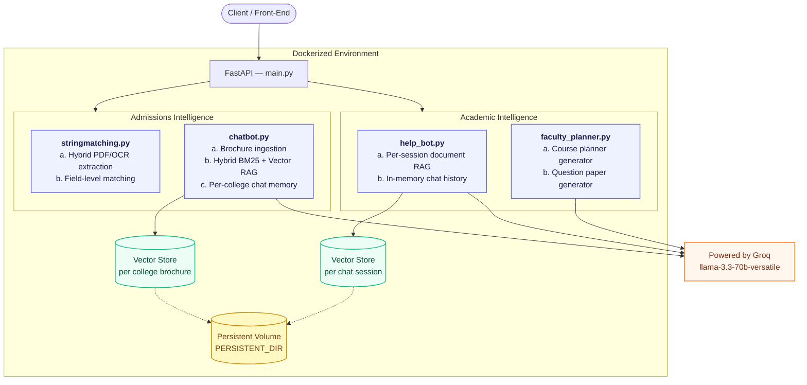
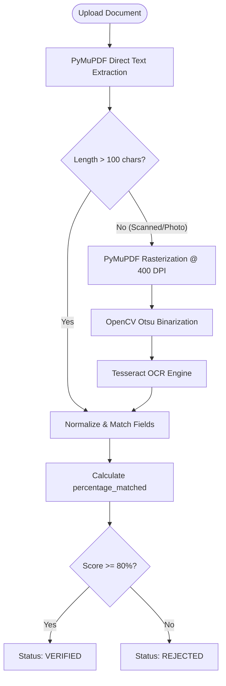
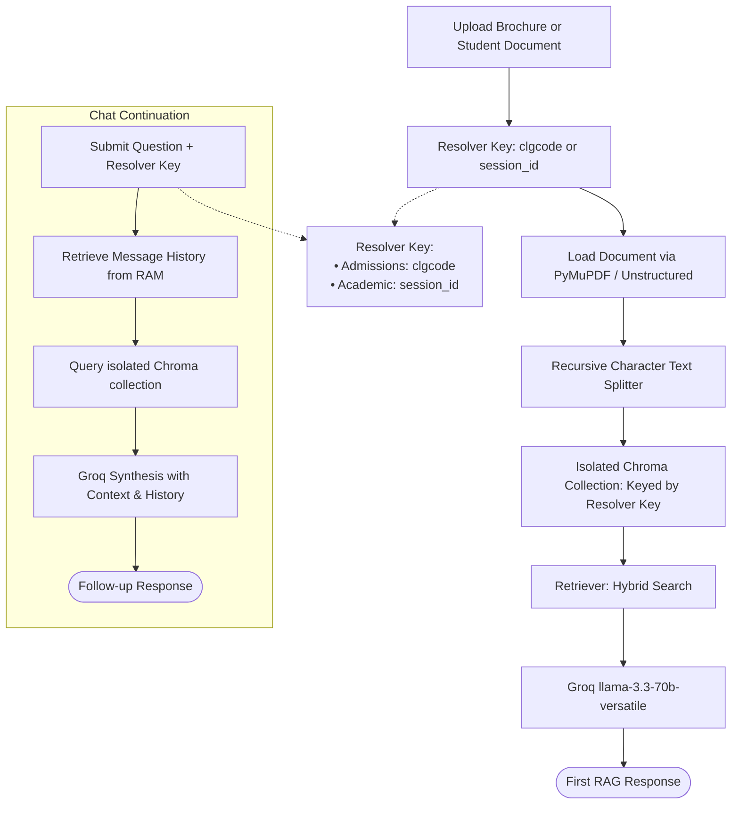

# 🎓 Campus One AI

**Campus One AI** is a FastAPI backend designed to bring cutting-edge AI assistance to key aspects of student and institutional life: **admissions processing** and **academic productivity**.

The project is structured into two completely independent modules, mounted onto a single FastAPI application:
1. **Admissions Intelligence**: Document validation, OCR verification, and interactive college brochure chatbots.
2. **Academic Intelligence**: Session-scoped student Q&A over study materials, lesson planners, and exam paper generators.

💡 **Developed by [Vasu Goel](https://github.com/vasug27)**

---

## 🧩 Core Design & Features

- **🔌 Decoupled & CORS-Enabled API**: Admissions and Academic modules are kept completely independent, enabling future microservices splitting and easy frontend integration.
- **🛡️ Intelligent Document Verification**: Direct PDF text parsing with an automatic fallback to an OpenCV + Tesseract OCR pipeline. Employs flexible verification rules for Aadhaar and DOB.
- **💬 Hybrid RAG Engine**: Combines keyword search (BM25) with semantic search (ChromaDB vector store) using an Ensemble Retriever (50/50 split) to deliver accurate answers with page-level citations.
- **🔒 Multi-Tenant Chat Isolation**: Creates dynamic, session-scoped ChromaDB collections (`hb_<uuid>`) per student chat session, guaranteeing strict data isolation.
- **📝 Structured Planning & Validation**: Generates course planners and exam papers conforming to strict, programmatically validated JSON schemas.

---

## 🛠️ Architecture Design



Both modules are wired into the same **FastAPI()** instance in **main.py**, but neither imports the other's internals. The only shared resources are the persistence convention (**PERSISTENT_DIR**) and the embedding model.

---

## 🛠 Tech Stack

| Layer | Technology Used |
|---|---|
| **API Framework** | FastAPI, Uvicorn |
| **LLM (Generation)** | Groq, `llama-3.3-70b-versatile` via `langchain-groq` |
| **Embeddings** | `sentence-transformers/all-MiniLM-L6-v2` (Local CPU execution) |
| **Orchestration** | LangChain (LCEL, `EnsembleRetriever`, `RunnableWithMessageHistory`) |
| **Vector Store** | ChromaDB (one persistent collection per entity) |
| **Lexical Retrieval** | `rank-bm25` via `BM25Retriever` |
| **PDF Parsing** | `pdfplumber`, `PyMuPDF` (`fitz`) |
| **OCR Engine** | `pytesseract` (English + Hindi), OpenCV preprocessing |
| **Slide Parsing** | `unstructured` (`UnstructuredPowerPointLoader`) |
| **Containerization** | Docker, Docker Compose, Persistent Named Volume |

---

## 📁 Directory Structure (Git-Tracked)

```
Campus_One_AI/
├── Admissions_Intelligence/
│   ├── chatbot.py            # Brochure ingestion + hybrid RAG chat
│   └── stringmatching.py     # Document OCR extraction + field verification
├── Academic_Intelligence/
│   ├── help_bot.py           # Session-based student document Q&A
│   └── faculty_planner.py    # Course planner + question paper generation
├── main.py                   # FastAPI app, routers, college registry
├── download_model.py         # Script to fetch & bundle the embedding model
├── requirements.txt          # Python dependencies
├── Dockerfile                # Multi-stage Docker deployment config
├── docker-compose.yml        # Docker orchestration with persistent volume mapping
├── README.md                 # Project documentation
├── .dockerignore
└── .gitignore
```

--- 


## 🏫 Module Details

### 🏫 Module 1: Admissions Intelligence

#### 📄 Document Verification (`stringmatching.py`)
Validates uploaded documents (10th/12th marksheet, Aadhar, entrance scorecard) against form data the applicant entered.



#### 💬 Brochure RAG Chatbot (`chatbot.py`)
* **Ingestion:** Loads a brochure with `PyMuPDFLoader`, tags pages with `clgcode`/`clg_name`, splits into 400-char chunks (100 overlap), and persists chunks as JSON (for BM25) and as Chroma embeddings, keyed by college code.
* **Retrieval:** A fresh `EnsembleRetriever` per request: BM25 (k=4) + MMR vector search (k=4, fetch_k=20), weighted equally.
* **Conversation:** An LCEL pipeline (retrieve ➡️ format ➡️ prompt ➡️ LLM ➡️ parse) wrapped in `RunnableWithMessageHistory`, so each `(clgcode, session_id)` keeps its own memory.
* **Caching:** Chains are cached per `clgcode` and invalidated on re-upload via `/update-brochure`.

---

### 📚 Module 2: Academic Intelligence

#### 🤖 Student Help Bot (`help_bot.py`)
A session-based document Q&A bot, scoped to one student's own uploaded file (PDF, PPT/PPTX, TXT, MD) rather than a shared institutional document.
* **Ingestion:** Loads the student's study document using `PyMuPDFLoader` or `UnstructuredPowerPointLoader`, splits it into 800-char chunks (150 overlap), and builds a session-specific vector store collection.
* **Retrieval:** Performs dynamic vector search (k=5) over the session collection to retrieve relevant sections for each student question.
* **Isolation:** Allocates a unique Chroma collection name (`hb_<uuid>`) per session, ensuring strict multi-tenant isolation so student sessions never leak into each other.
* **Conversation:** Runs a memory pipeline to continue discussions using in-memory turn counts and session history stored in RAM.



#### 📝 Faculty Planner (`faculty_planner.py`)
LLM-driven generation tools that structure syllabus notes and generate balanced examination question papers.
* **Ingestion:** Extracts text from topics or parses uploaded syllabus files (PDF, PPT/PPTX, TXT).
* **Course Planner:** Chains the course topics/notes into a prompt to generate structured, lecture-by-lecture lesson schedules mapping exactly to the target lecture count.
* **Question Paper:** Creates test papers matching targeted parameters, as per user needs.
* **Validation:** Programmatically forces and validates LLM generation against JSON schemas (enforcing MCQ option keys, model answers, and making sure question marks sum exactly to `max_marks`).

---

## 🗄️ Database & Data Design

Campus One AI utilizes a **stateless-compute, stateful-storage** paradigm. In place of a heavy database engine, the backend implements a **file-system-backed, collection-oriented persistence layer**, rooted at the configurable directory (`PERSISTENT_DIR`). 

This structure allows the application to remain lightweight, portable, and perfectly suited for containerized deployments with direct directory mounts.

### 📁 Directory Layout
```
PERSISTENT_DIR/
├── registry.json                  # Maps college codes to official college names
├── uploaded_docs/
│   └── <clgcode>.pdf              # Persistent store for raw uploaded PDF brochures
├── raw_docs/
│   └── <clgcode>.json             # Cached tokenized chunks for BM25 search
└── vectorstore/
    ├── <clgcode>/                 # ChromaDB vector index per college brochure
    └── helpbot/
        └── <session_id>/          # ChromaDB vector index isolated per student session
```

### 📄 Persistent Storage Schemas

#### 1. Registry Database Schema (`registry.json`)
A simple JSON dictionary mapping alphanumeric college codes to the official university names.
```json
{
  "CLG101": "College A",
  "CLG102": "College B"
}
```

#### 2. Raw Document Chunks (`raw_docs/<clgcode>.json`)
Since LangChain's `BM25Retriever` compiles in-memory and does not support out-of-the-box file serialization, document chunks are stored on disk in JSON format. This allows quick instantiation of lexical indices on system startup without re-parsing original PDFs.
```json
[
  {
    "page_content": "The tuition fee per semester for B.Tech students is Rs. XXXX...",
    "metadata": {
      "source": "uploaded_docs/CLG101.pdf",
      "page": 4,
      "clgcode": "CLG01",
      "clg_name": "College A"
    }
  }
]
```
#### 3. API Schema Designs (`HistoryResponse`)
- **session_id**: string
- **document**: string
- **created_at**: string
- **last_active**: string
- **total_turns**: integer
- **history**: array of objects (message logs containing `role` and `content`)

### 🧬 Isolation & Thread Safety
* **Chroma Vector Store Isolation:** Each brochure or student study help-bot session gets its own independent database subdirectory under `vectorstore/`. This ensures strict multi-tenant isolation, eliminating query leakage between sessions without requiring complex metadata filters.
* **Transient States:** Active chains, in-memory caches, and chat histories (`ChatMessageHistory`) are kept in RAM (`session_store` and `chains` dictionaries) and dynamically resolved, keeping the disk operations simple and efficient.

---

## 🔐 Environment Variables (`.env`)

Configure the following variables in a `.env` file in the root of the project to set up model settings and system directories:

| Key | Description | Default Value | Required |
|---|---|---|---|
| `GROQ_API_KEY` | API credential key generated from the Groq Developer Console | None | **Yes** |
| `GROQ_MODEL` | LLM model identifier to use for text generation | `llama-3.3-70b-versatile` | No |
| `PERSISTENT_DIR` | Local directory path where database files, registries, and raw PDFs are persisted | `.` | No |

---

## 📡 API Reference

### 🏫 Admissions Intelligence Routes

| Method | Endpoint | Required Parameters | Optional Parameters | Description |
|:---|:---|:---|:---|:---|
| **POST** | `/verify` | `documents`, `doc_types`, `input_fields` | None | Validates Aadhar/VID, 10th, or 12th marksheets against form data |
| **POST** | `/upload-brochure` | `clgcode`, `clg_name`, `file` | None | Uploads, chunks, and indexes a new college brochure PDF |
| **POST** | `/update-brochure` | `clgcode`, `clg_name`, `file` | None | Overwrites and re-indexes an existing college's brochure |
| **GET** | `/colleges` | None | None | Lists all colleges currently indexed in the registry |
| **POST** | `/chat` | `clgcode`, `question` | `session_id` | Submits a question about a brochure using Hybrid RAG and returns cited answers |

### 📚 Academic Intelligence Routes

| Method | Endpoint | Required Parameters | Optional Parameters | Description |
|:---|:---|:---|:---|:---|
| **POST** | `/academic/chat/start` | `file`, `question` | None | Upload an academic document (PDF, PPT, PPTX, TXT, MD) and ask first question. Returns `session_id`. |
| **POST** | `/academic/chat/{session_id}` | `session_id` (path), `question` | None | Ask follow-up question. The model retains history and resolves references automatically. |
| **GET** | `/academic/chat/{session_id}/history` | `session_id` (path) | None | Retrieves complete message logs for the session. |
| **GET** | `/academic/sessions` | None | None | Lists all active student help-bot sessions. |
| **POST** | `/academic/faculty/course-planner` | `subject_name`, `subject_code`, `num_lectures` | `course_contents`, `file` | Generates structured course plans. Provide `course_contents` (topics) OR `file` (syllabus), or both. |
| **POST** | `/academic/faculty/question-paper` | `subject`, `max_marks`, `num_objective`, `num_subjective`, `difficulty` | `instructions`, `file`, `syllabus` | Generates question paper with answers. Provide `file` (study notes) OR `syllabus` (topics), or both. |

---

## 🔬 Sample Input / Output

### `POST /verify` (Admissions, multipart form)
* **Request:** Form fields `documents` (list of PDF files), `doc_types` (comma-separated string), and `input_fields` (JSON string of applicant details).
```json
{
  "doc_types": "10th_marksheet,12th_marksheet,aadhar_card,entrance_scorecard",
  "input_fields": {
    "name": "FirstName LastName",
    "father_name": "FirstName LastName",
    "mother_name": "FirstName LastName",
    "dob": "DD/MM/YYYY",
    "roll_number_10th": "XXXXXX",
    "roll_number_12th": "XXXXXX",
    "board": "Board Name",
    "aadhar_number": "XXXXXXXXXXXX",
    "application_number": "XXXXXXXXXXXX",
    "final_percentile_score": "XX.XXXXXXX"
  },
  "documents": ["10th_marksheet.pdf", "12th_marksheet.pdf", "aadhar_card.pdf", "entrance_scorecard.pdf"]
}
```
* **Response:**
```json
{
  "10th_marksheet": {
    "parsed_data": "DATA....DATA",
    "matched_data": {
      "name": true,
      "father_name": true,
      "mother_name": true,
      "dob": true,
      "roll_number_10th": true,
      "board": true
    },
    "percentage_matched": 100.0,
    "verified_status": "VERIFIED"
  },
  "12th_marksheet": {
    "parsed_data": "DATA....DATA",
    "matched_data": {
      "name": true,
      "father_name": true,
      "mother_name": true,
      "roll_number_12th": true,
      "board": true
    },
    "percentage_matched": 100.0,
    "verified_status": "VERIFIED"
  },
  "aadhar_card": {
    "parsed_data": "DATA....DATA",
    "matched_data": {
      "name": true,
      "aadhar_number": false,
      "father_name": true
    },
    "percentage_matched": 66.7,
    "verified_status": "REJECTED"
  },
  "entrance_scorecard": {
    "parsed_data": "DATA....DATA",
    "matched_data": {
      "name": true,
      "application_number": true,
      "final_percentile_score": true
    },
    "percentage_matched": 100.0,
    "verified_status": "VERIFIED"
  }
}
```

### `POST /chat` (Admissions, brochure RAG)
* **Request:**
```json
{
  "clgcode": "CLG101",
  "session_id": "a1b2c3d4",
  "question": "What is the hostel fee for the 2026-27 batch?"
}
```
* **Response:**
```json
{
  "answer": "The hostel fee for the 2026-27 batch is Rs. XX as mentioned on page 14 of the brochure.",
  "clgcode": "CLG01",
  "session_id": "a1b2c3d4"
}
```

### `POST /academic/chat/start` (Academic Student Help Bot)
* **Request (Multipart Form):**
  * `file`: Supported types: PDF, PPT, PPTX, TXT, MD
  * `question`: First query/question about the document.
* **Response:**
```json
{
  "session_id": "f47ac10b-58cc-4372-a567-0e02b2c3d479",
  "document_name": "DAA_Unit1_Notes.pdf",
  "answer": "Asymptotic notation describes the growth rate of an algorithm's running time as input size increases."
}
```

### `POST /academic/faculty/course-planner`
* **Request (Multipart Form):**
  * `subject_name`
  * `subject_code`
  * `num_lectures`
  * `course_contents`: Comma-separated chapter/topic names.
  * `file`: Syllabus / course outline PDF, PPT, PPTX or TXT.
  *(Note: At least one of `course_contents` or `file` must be provided)*
* **Response:**
```json
{
  "subject_name": "DAA",
  "subject_code": "CSXX",
  "total_lectures": 2,
  "schedule": [
    {
      "lecture_number": 1,
      "topic": "Introduction to Algorithm Design",
      "remarks": "Introduction"
    },
    {
      "lecture_number": 2,
      "topic": "Motivation and Concept of Algorithmic Efficiency",
      "remarks": "Theory"
    }
  ]
}
```

### `POST /academic/faculty/question-paper`
* **Request (Multipart Form):**
  * `subject`
  * `max_marks`
  * `num_objective`
  * `num_subjective`
  * `difficulty` (`easy` | `medium` | `hard`)
  * `instructions`: Extra instructions for LLM paper generation.
  * `file`: Study notes / PPT / PDF.
  * `syllabus`: Plain-text syllabus details.
  *(Note: At least one of `file` or `syllabus` must be provided)*
* **Response:**
```json
{
  "title": "Design Paradigms",
  "total_marks": 15,
  "total_questions": 2,
  "difficulty": "MEDIUM",
  "questions": [
    {
      "question_number": 1,
      "type": "mcq",
      "question": "Which algorithm design paradigm does Merge Sort follow?",
      "options": {
        "A": "Greedy",
        "B": "Divide and Conquer",
        "C": "Backtracking",
        "D": "Dynamic Programming"
      },
      "correct_answer": "B",
      "explanation": "Merge Sort splits the array into halves, sorts them recursively, and merges the results.",
      "marks": 5
    },
    {
      "question_number": 2,
      "type": "subjective",
      "question": "Explain the difference between dynamic programming and divide and conquer with an example.",
      "model_answer": "Dynamic programming solves overlapping subproblems and stores results, while divide and conquer solves independent subproblems without reuse.",
      "marks": 10
    }
  ]
}
```

---

## 🛠️ Setup Guide

Follow these steps to set up and run the Campus One AI application locally:

### Prerequisites
- Python 3.10 or 3.11 installed.
- **Tesseract OCR** installed on your system:
  - **Ubuntu/Linux:** `sudo apt-get update && sudo apt-get install -y tesseract-ocr tesseract-ocr-eng tesseract-ocr-hin libgl1-mesa-glx`
  - **macOS:** `brew install tesseract`
  - **Windows:** Download the installer from UB Mannheim, install it, and add the installation folder (e.g., `C:\Program Files\Tesseract-OCR`) to your system **Path** environment variable.

### 1. Clone the Codebase
```bash
git clone https://github.com/vasug27/Campus_One_AI.git
cd Campus_One_AI
```

### 2. Set Up a Virtual Environment (Highly Recommended)
Creating a virtual environment ensures dependencies do not conflict with other system Python packages.
```bash
# Create the environment
python -m venv venv

# Activate the environment
# On Windows (PowerShell):
.\venv\Scripts\Activate.ps1
# On Windows (CMD):
.\venv\Scripts\activate.bat
# On Linux / macOS:
source venv/bin/activate
```

### 3. Install Dependencies
```bash
# Upgrade pip to latest version
python -m pip install --upgrade pip

# Install CPU-specific PyTorch first to reduce bundle size
pip install torch==2.1.2 --index-url https://download.pytorch.org/whl/cpu

# Install remaining requirements
pip install -r requirements.txt
```

### 4. Bundle the Embedding Model (First Run Only)
```bash
python download_model.py
```
This downloads `all-MiniLM-L6-v2` into `models/all-MiniLM-L6-v2/` so it isn't fetched from the Hugging Face Hub on every boot.

### 5. Configure Environment Variables
Create a `.env` file in the project root:
```env
GROQ_API_KEY=your_groq_api_key_here
GROQ_MODEL=llama-3.3-70b-versatile
PERSISTENT_DIR=.
```
> Get a Groq API key from the [Groq Console](https://console.groq.com/).

### 6. Run the Application
```bash
uvicorn main:app --reload
```
API interactive documentation will be available at `http://localhost:8000/docs`.

---

## 🐳 Docker Deployment

Run the entire application in a containerized environment using Docker Compose:
```bash
docker compose up --build
```
This builds a Python 3.11-slim image with Tesseract pre-installed, installs CPU-only PyTorch separately, and copies the app and bundled embedding model. 

It mounts the **campus_data** named volume at **/data** (**PERSISTENT_DIR=/data**). This ensures that all your data (like the registry mapping in **registry.json** and indexed brochures under **raw_docs/** and **vectorstore/**) survives container restarts and rebuilds.

---

## 🧑 Author

**Vasu Goel**

[](mailto:vasugoel2754@gmail.com)
[](https://www.linkedin.com/in/vasugoel503/)
[](https://github.com/vasug27)

---

Built for CampusOne (A Complete Campus Management System).